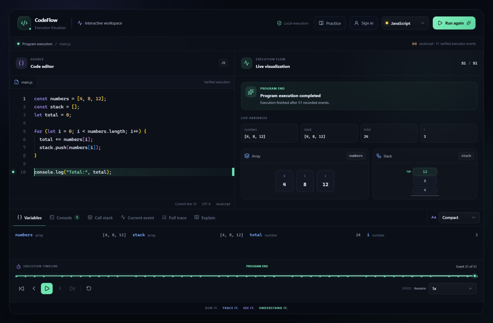
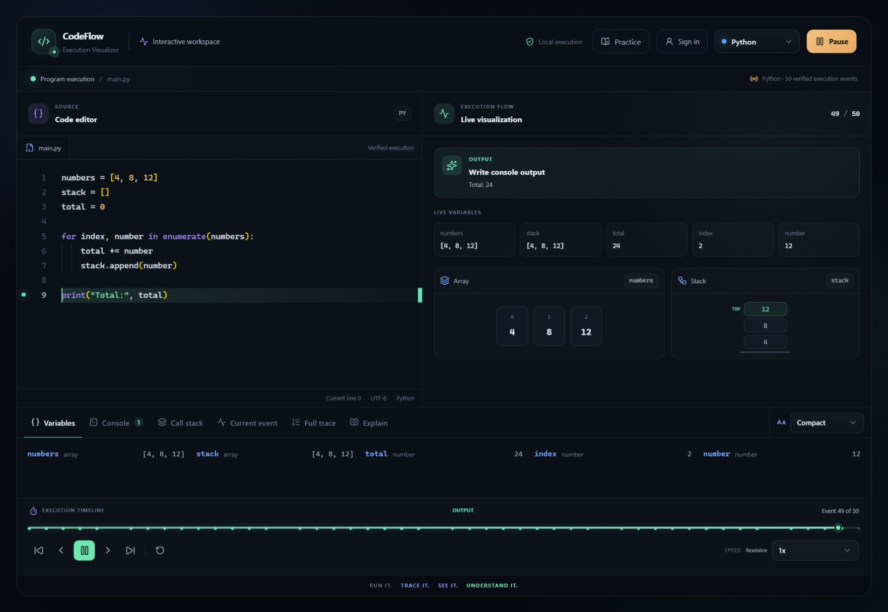
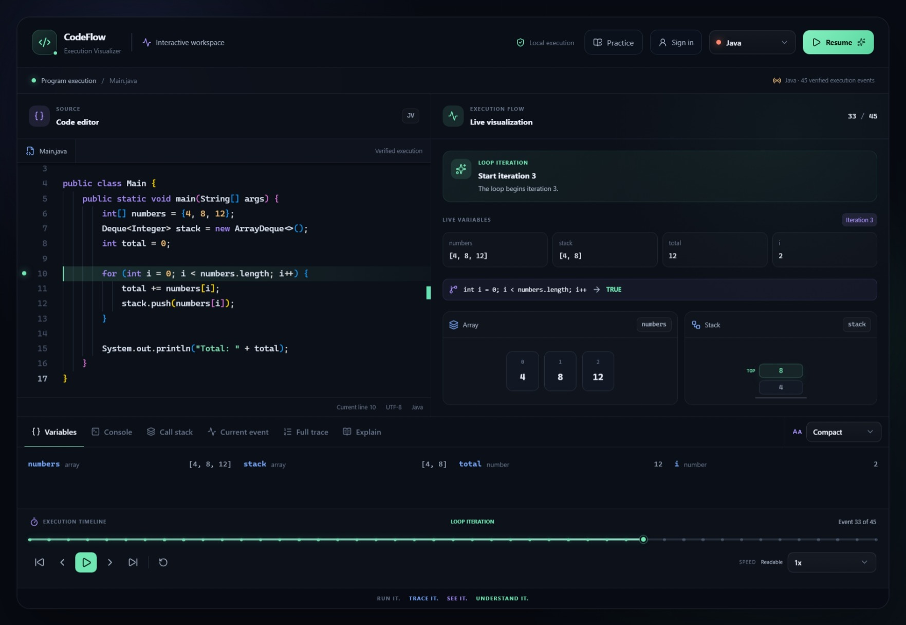
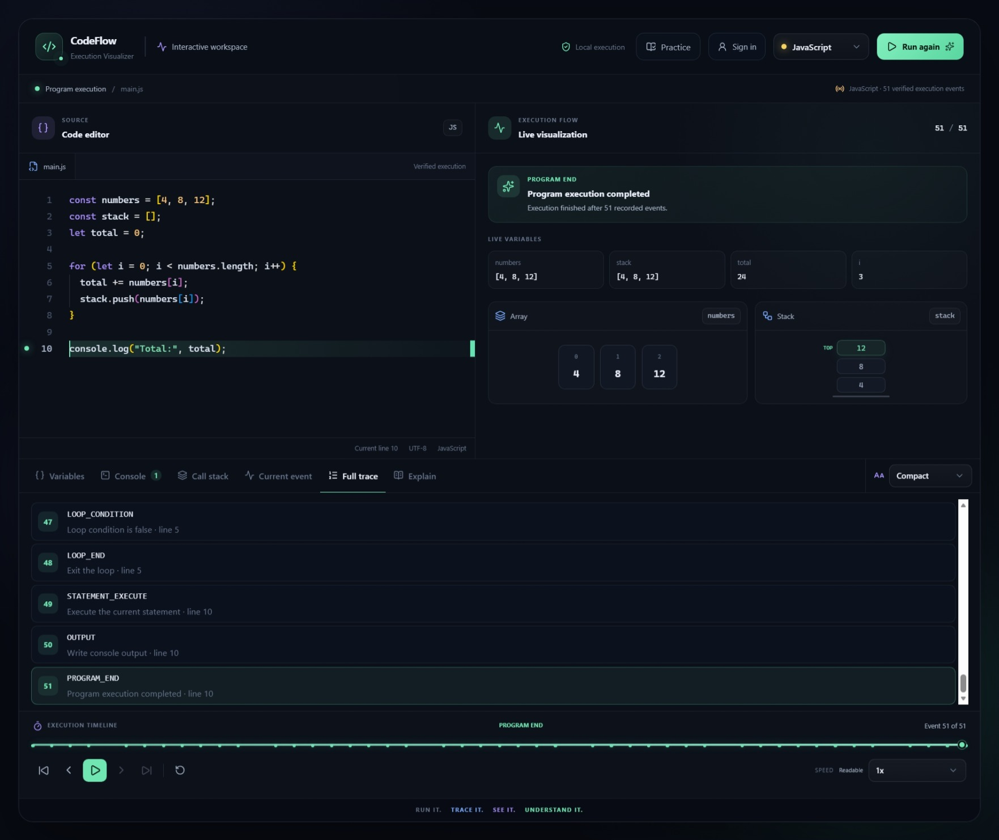
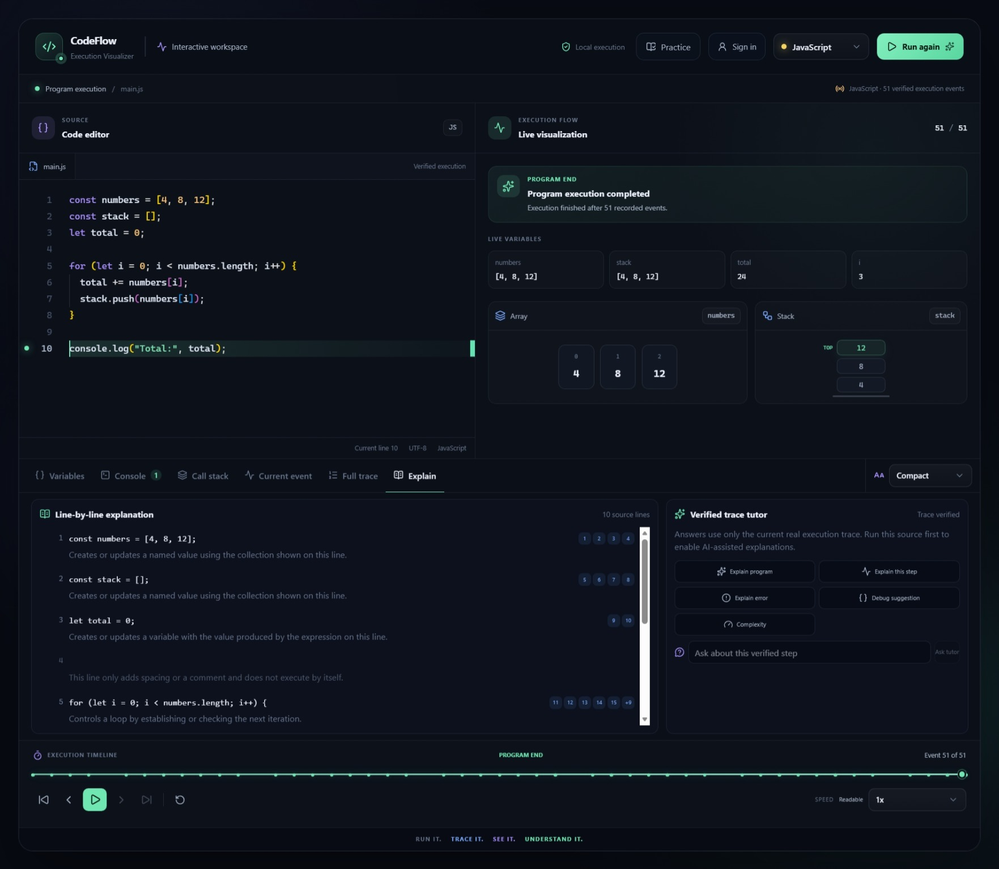
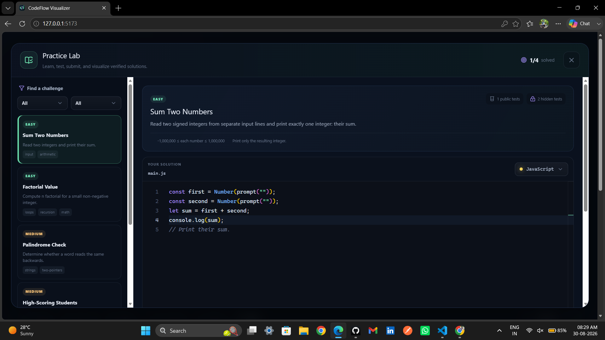

# CodeFlow Visualizer

> **Run It. Trace It. See It. Understand It.**

[](https://github.com/meganathank-dev/codeflow-visualizer/actions/workflows/ci.yml)

[](https://codeflow-visualizer-zeta.vercel.app/)

CodeFlow Visualizer is an interactive multi-language execution visualization and learning platform. It executes real JavaScript, Python, Java, and SQL code, converts runtime behaviour into a standardized trace, and presents each execution step through synchronized visualizations.

The platform is designed for students, teachers, programming learners, and developers who want to understand what happens internally when code runs.

## Live Deployment

| Component | Platform | Status |
|---|---|---|
| Web application | Vercel | [Open CodeFlow Visualizer](https://codeflow-visualizer-zeta.vercel.app/) |
| API service | Render | [Health endpoint](https://codeflow-api-vfg0.onrender.com/api/health) |
| Execution service | Render | Authenticated service-to-service runner |
| User data | MongoDB Atlas | Persistent accounts, projects, history, and progress |
| Verification | GitHub Actions | [View CI workflow](https://github.com/meganathank-dev/codeflow-visualizer/actions/workflows/ci.yml) |

The Render services currently use free instances. After a period of inactivity,
the first request can take up to about a minute while the services wake up.

## Application Showcase

| JavaScript Execution | Python Playback |
|---|---|
|  |  |

| Java Visualization | Full Execution Trace |
|---|---|
|  |  |

| AI-Assisted Explanation | Practice Lab |
|---|---|
|  |  |

## Supported Languages

- JavaScript
- Python
- Java
- SQL

JavaScript, Python, and Java use real program-execution traces. SQL uses an isolated in-memory SQLite teaching dataset and a specialized relational-query trace.

## Main Features

### Real Multi-Language Execution

- Real JavaScript execution and tracing
- Real Python execution and tracing
- Java execution using JDI
- SQL execution using isolated SQLite
- Common cross-language execution-trace format
- Syntax-error and runtime-error visualization
- Program-input handling
- Execution timeouts and restricted-source protection

### Interactive Visualization

- Current source-line highlighting
- Live variables
- Arrays and stacks
- Console output
- Function and call-stack state
- Loop and condition visualization
- Numbered full execution trace
- Current-event inspection
- First, previous, play, pause, next, last, and reset controls
- Timeline seeking
- Adjustable playback speed

### Data-Structure Visualization

- Stack
- Queue
- Linked list
- HashMap
- Binary search tree
- Min heap
- Graph
- Node, edge, pointer, and reference reconstruction

### Algorithm Visualization

- Linear search
- Binary search
- Bubble sort
- Selection sort
- Insertion sort
- Merge sort
- Quick sort
- Factorial
- Fibonacci
- Recursive array sum
- Dynamic programming
- 0/1 Knapsack
- Tower of Hanoi
- BFS and DFS traversal

### Verified AI Explanations

AI features are restricted to verified execution data so that generated explanations cannot invent program state.

Available explanation modes include:

- Explain the complete program
- Explain the current execution step
- Explain an error
- Generate debugging guidance
- Explain time and space complexity
- Ask questions using the verified trace tutor
- View deterministic line-by-line explanations

The OpenAI provider is optional. When no API key is configured, the platform continues working through its local verified-trace explanation engine.

### Practice Lab

The integrated Practice Lab provides:

- Curated programming challenges
- JavaScript, Python, Java, and SQL starter code
- Difficulty and language filters
- Public test execution
- Server-side hidden tests
- Solution submission
- Accepted and failed verdicts
- Authenticated submission history
- Learner progress tracking
- Direct handoff from a public test to the execution visualizer

Hidden test inputs and expected results remain on the server.

### User Platform

Guest execution is available without an account. Signed-in users additionally receive:

- Registration and login
- Secure access and refresh sessions
- User profile
- Private saved projects
- Project load, rename, duplicate, and delete actions
- Execution history
- Personal dashboard
- Language-activity summary
- Forgot-password and one-time password-reset flows
- Practice submission history and progress

### Accessibility and Classroom Support

- Compact mode enabled by default
- Presentation mode for teachers and projectors
- Larger readable inspector content
- Keyboard-accessible custom dropdowns
- Accessible language and playback controls
- Clear playback action labels
- Improved colour contrast and focus states
- Responsive workspace layout

## Technology Stack

### Frontend

- React 19
- Vite 8
- JavaScript
- Tailwind CSS
- Monaco Editor
- Framer Motion
- Lucide React

### Backend

- Node.js 22
- Express.js 5
- MongoDB
- Mongoose
- Token-based authentication
- OpenAI Responses API integration

### Execution and Tracing

- JavaScript AST instrumentation
- Python runtime tracing
- Java Debug Interface
- SQLite
- Standardized execution-trace package
- Reusable visualizer-core package

### Development and Deployment

- pnpm workspace
- GitHub Actions
- Docker
- Vercel frontend hosting
- Render API and execution-service hosting
- MongoDB Atlas
- Nginx
- Structured request logging
- Release-readiness validation

## Core Architecture

```text
Source Code
     │
     ▼
Language Adapter
     │
     ▼
Execution Runtime
     │
     ▼
Standardized Trace
     │
     ▼
State Reconstruction
     │
     ▼
Visualization Engine
     │
     ▼
Timeline, Inspector and Animation
```

All supported languages produce a compatible trace contract. The frontend reconstructs program state from that trace instead of maintaining a separate visualization engine for every language.

## Project Structure

```text
codeflow-visualizer/
├── apps/
│   ├── api/                  # Express API and user platform
│   ├── execution/            # Dedicated execution service
│   └── web/                  # React and Vite frontend
├── packages/
│   ├── execution-trace/      # Shared trace domain and validation
│   └── visualizer-core/      # State reconstruction and playback
├── docs/                     # Architecture and phase documentation
│   └── screenshots/          # README application screenshots
├── deploy/                   # Production configuration templates
├── pocs/                     # Cross-language conformance tests
├── scripts/                  # Development and release utilities
├── .github/workflows/        # Continuous integration
├── package.json
└── pnpm-workspace.yaml
```

## Prerequisites

Install the following software before running the project:

- Node.js 22 or later
- pnpm 11 or later
- Python 3.12 or compatible
- Temurin JDK 17
- MongoDB for persistent user accounts and projects
- Git

Verify the main tools:

```cmd
node --version
pnpm --version
python --version
java --version
javac --version
git --version
```

Java 17 is intentionally used for deterministic JDI tracing across local development and GitHub Actions.

## Local Installation

### 1. Clone the repository

```cmd
git clone https://github.com/meganathank-dev/codeflow-visualizer.git
cd codeflow-visualizer
```

### 2. Install dependencies

```cmd
pnpm install
```

### 3. Create the API environment file

```cmd
copy apps\api\.env.example apps\api\.env
```

The default local MongoDB connection is:

```text
mongodb://127.0.0.1:27017/codeflow_visualizer
```

Replace the access-token and refresh-token secrets in `apps/api/.env` with two different long random values.

If MongoDB is unavailable during local development, CodeFlow can use temporary in-memory user storage. MongoDB is required in production.

### 4. Configure optional AI explanations

Add an OpenAI API key only to `apps/api/.env`:

```env
OPENAI_API_KEY=
OPENAI_MODEL=gpt-5.6
```

Never commit a real API key. The `.env` file is ignored by Git.

### 5. Start the application

```cmd
pnpm dev
```

The development starter launches the services in readiness order.

Open:

```text
http://127.0.0.1:5173/
```

Local service addresses:

| Service | Address |
|---|---|
| Web application | `http://127.0.0.1:5173` |
| API service | `http://127.0.0.1:4000` |
| API health endpoint | `http://127.0.0.1:4000/api/health` |
| Execution service | `http://127.0.0.1:4100` |

## Available Commands

| Command | Purpose |
|---|---|
| `pnpm dev` | Start all development services in readiness order |
| `pnpm dev:parallel` | Start all services in parallel |
| `pnpm dev:web` | Start only the frontend |
| `pnpm dev:api` | Start only the API |
| `pnpm dev:execution` | Start only the execution service |
| `pnpm test` | Run the complete verification suite |
| `pnpm test:execution` | Run execution-service tests |
| `pnpm test:api` | Run API tests |
| `pnpm test:web` | Run frontend presentation tests |
| `pnpm test:release` | Run release-readiness tests |
| `pnpm build` | Create the production frontend build |
| `pnpm release:check` | Validate production configuration |

## Testing

Run the complete test suite:

```cmd
pnpm test
```

The suite validates:

- Execution-trace integrity
- State reconstruction
- JavaScript, Python, Java, and SQL execution
- Cross-language data structures and algorithms
- API forwarding and request validation
- Authentication and user-platform behaviour
- Verified AI explanation boundaries
- Practice Lab judging and hidden-test confidentiality
- Frontend visualization and accessibility
- Cross-language conformance
- Production release-readiness contracts

Build the production frontend:

```cmd
pnpm build
```

## Security and Execution Isolation

The local execution service is intended for trusted development use.

The public portfolio deployment runs the API and execution service separately.
The execution runner requires service-to-service authentication, and its secret
is never exposed to the browser. The API remains responsible for source-policy
validation, request rate limiting, timeout budgets, and execution forwarding.

The platform includes:

- Restricted-source validation
- Execution timeout protection
- Request rate limiting
- Security headers
- Production origin enforcement
- Separate limits for execution, AI, and account operations
- Request IDs and structured logs
- Hidden practice-test confidentiality
- Fail-closed production execution checks

This authenticated restricted-demo mode is designed for a limited portfolio or
classroom demonstration. It is not a production-grade multi-tenant sandbox for
high-volume arbitrary untrusted code execution.

Public deployment of arbitrary code execution requires a separate isolated execution environment with confirmed:

- Network isolation
- Filesystem isolation
- CPU limits
- Memory limits
- Process limits
- Ephemeral workspaces

The full production path fails closed when these controls are not attested.
Restricted-demo execution must be enabled explicitly with matching API and
execution-service credentials.

## Production Preparation

Create the production environment file:

```cmd
copy deploy\production.env.example deploy\production.env
```

Replace every placeholder value and run:

```cmd
pnpm release:check
```

Refer to the deployment guide and release checklist before hosting the application.

## Documentation

- [Technical Architecture](docs/architecture.md)
- [Phase 0 — Technical Validation](docs/phase-0-summary.md)
- [Phase 1 — Architecture Foundation](docs/phase-1-summary.md)
- [Phase 2 — Real JavaScript Execution](docs/phase-2-summary.md)
- [Phase 3 — Real Python Execution](docs/phase-3-summary.md)
- [Phase 4 — Real Java JDI Execution](docs/phase-4-summary.md)
- [Phase 5 — SQL and Relational Visualization](docs/phase-5-summary.md)
- [Phase 6 — Cross-Language Data Structures](docs/phase-6-summary.md)
- [Phase 7 — Algorithms and Algorithm Closure](docs/phase-7-summary.md)
- [Phase 8 — Core MVP Completion](docs/phase-8-summary.md)
- [Phase 9 — MERN User Platform](docs/phase-9-summary.md)
- [Phase 10 — AI, Feedback and Reliability](docs/phase-10-summary.md)
- [Phase 11 — Accessibility, Reliability and Security](docs/phase-11-summary.md)
- [Final Phase 12 — Practice and Production Closure](docs/phase-12-summary.md)
- [Production Deployment](docs/deployment.md)
- [Final Release Checklist](docs/release-checklist.md)

## Project Status

CodeFlow Visualizer has completed all planned phases from Phase 0 through Final Phase 12.

Current verification status:

- Complete local test suite: Passed
- Production frontend build: Passed
- GitHub Actions verification: Passed
- Public Vercel deployment: Live
- Render API and authenticated execution services: Live
- MongoDB Atlas persistence: Verified
- JavaScript, Python, Java, and SQL production smoke tests: Passed
- Java tracing standardized on Temurin JDK 17

## Author

**Meganathan K**

- GitHub: [meganathank-dev](https://github.com/meganathank-dev)
- Repository: [codeflow-visualizer](https://github.com/meganathank-dev/codeflow-visualizer)

---

**Run It. Trace It. See It. Understand It.**
